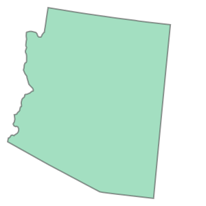

# GeoMesa - a GIS extension to Mesa Agent-Based Modeling

Currently with limited functionality, but the GeoSchelling example implements a geo version of the Schelling example and demonstrates basic functionality and visualization with leaflet.

Requires shapely, geojson, pyproj and rtree

This is a pre-release. No functionality guaranteed, bugs included

## Installation

You should clone the repository and install it via
```
pip install -r requirements.txt
pip install .
```

On windows you should use Anaconda to install the requirements with
```
conda install --yes --file requirements.txt
pip install .
```

## Getting started
You should be familiar with how [mesa](https://github.com/projectmesa/mesa) works.

Mesa-geo implements `GeoAgents`, which are exactly like normal Agents, except they have a `shape` attribute that is a [Shapely object](https://shapely.readthedocs.io/en/latest/manual.html). You can use `Shapely` directly to create arbitrary shapes, but in most cases you will want to import your shapes from a file. Currently, mesa-geo only allows to load GeoJSON objects, so you should convert your shapefiles in your favorite editor.
Mesa-geo also implements a `GeoSpace`, which is a continuous space for all your `GeoAgents`.

So let's get started with some shapes! We will work with [records of US states](http://eric.clst.org/Stuff/USGeoJSON). We use the `requests` library to retrieve the data, but you can also use `geojson` to work with local data.

```python
from mesa_geo import GeoSpace, GeoAgent
import requests
url = 'http://eric.clst.org/assets/wiki/uploads/Stuff/gz_2010_us_040_00_20m.json'
r = requests.get(url)
```

First we create a `State` Agent and a `SampleModel`. Both should look familiar if you have worked with mesa before.

```python
class State(GeoAgent):
    def __init__(self, unique_id, model, shape):
        super().__init__(unique_id, model, shape)

class SampleModel:
    def __init__(self, states):
        self.grid = GeoSpace()

        agent_kwargs = dict(model=self, unique_id='name')
        self.grid.create_agents_from_GeoJSON(states, agent=State, **agent_kwargs)
```

In the `SampleModel` we create agents from the GeoJSON file. Note that we need to define what kind of agent should be created and we need to provide this agents keyword arguments. Let's instantiate our model and look at one of the agents:

```python
m = GeoModel(r.json())

agent = m.grid.agents[0]
print(agent.unique_id)
agent.shape
```

If you work in the Jupyter Notebook your output should give you the name of the state and a visual representation of the shape.

    Arizona



You might realize some magic is going on here. We used "name" for the "unique_id" and since this is the name of a Feature property of the GeoJSON it got translated to the property value. By default `GeoSpace.create_agents_from_GeoJSON` also sets further agent attributes from the Feature properties.

```python
agent.CENSUSAREA
```

    113594.084

Let's start to do some spatial analysis. Since agents' shapes are Shapely objects, we can work with them directly. To query for neighboring states we can do the following

```python
other_agents = m.grid.agents[1:]

for oa in other_agents:
    if agent.shape.touches(oa.shape):
        print(oa.unique_id)
```

    California
    Colorado
    New Mexico
    Utah
    Nevada

We could also use a GeoSpace query:

```python
neighbors = m.grid.get_relation('touches', agent)
[a.unique_id for a in neighbors]
```

    ['California', 'Colorado', 'New Mexico', 'Utah', 'Nevada']

This uses the GeoSpaces internal Rtree index of all agents and can be considerably faster if you have a large number of agents and/or complex geometries.

To get a list of all states within a certain distance you can use the following

```python
[a.unique_id for a in m.grid.get_neighbors_within_distance(agent, 600000)]
```

    ['California',
    'Colorado',
    'New Mexico',
    'Oklahoma',
    'Wyoming',
    'Idaho',
    'Utah',
    'Nevada']

The unit for the distance depends on the coordinate reference system (CRS) of the GeoSpace. Since we did not specify the CRS, mesa-geo defaults to the 'Web Mercator' projection (in meters). However, it's only appropriate for measurements near the equator. If you want to do some serious measurements you should always set an appropriate CRS. This is easily enough done by initializing you GeoSpace with for example `GeoSpace(crs='epsg:2163')`. All transformations from the GeoJSON geographical coordinates is done automatically.

## Going further

To get a deeper understanding of mesa-geo you should checkout the GeoSchelling example. It also implements a Leaflet visualization which will be made more general and similar to use as the  CanvasGridVisualization in a future release.

## Implemented and future functions
* Add agents with shapes from GeoJSON
* Shapes are Shapely objects (with distance, buffer, etc. functions accesible)
* CRS transformations (GeoJSON is always WGS84, unsuitable for accurate calculations)
* compute relation (intersection, within, etc. ) between shapes with speed-up from r-tree indexing

To implement further functions I need feedback on which functionality is desired by users. Please post a message [here](https://groups.google.com/forum/#!topic/projectmesa-dev/qEf2XBFZYnI) or open an issue if you have any ideas or recommendations.
